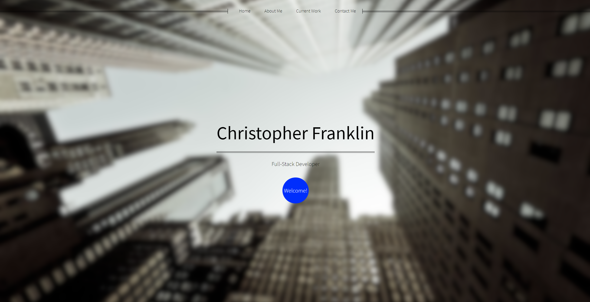
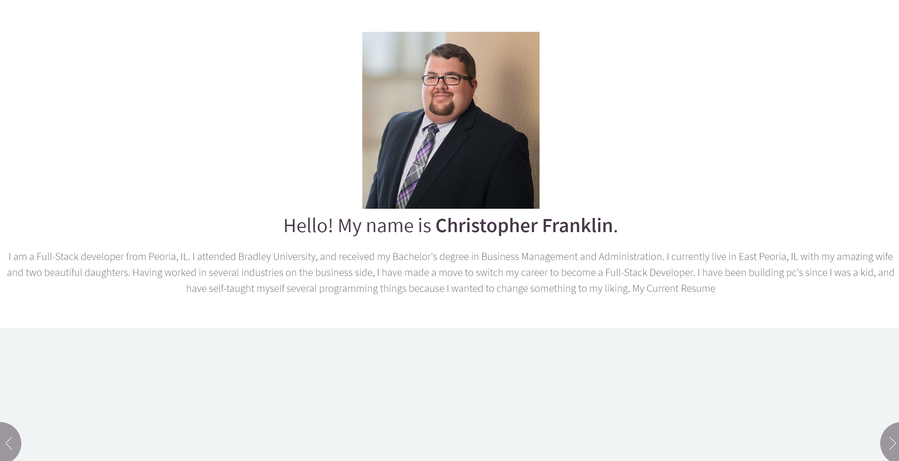
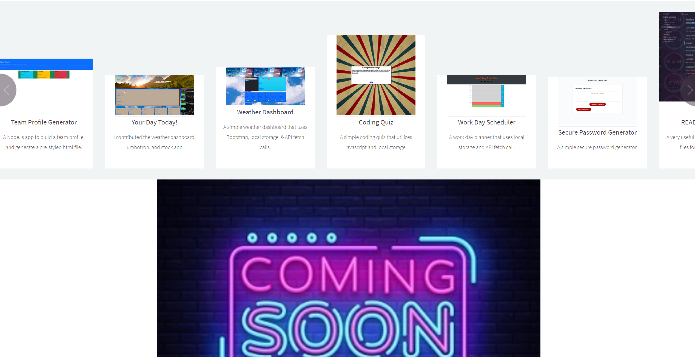
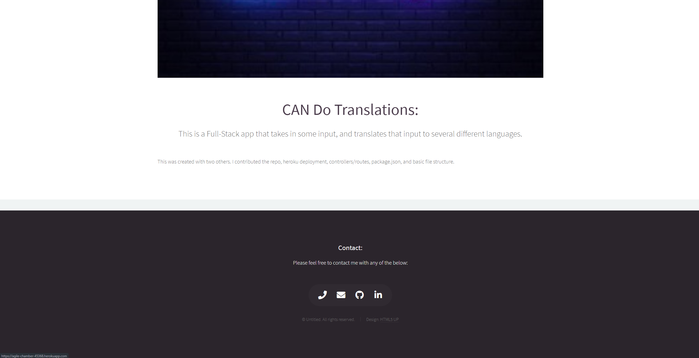

# Professional-Portfolio
The Professional Portfolio of Christopher Franklin

## Live Deployment

https://christopherfranklin.dev/

##List of used technology:
HTML5
CSS
JavaScript
SASS
Webfonts

## Installation

Use git clone to clone this repository to your local drive

'''bash
git clone "insert repo"
'''

## References
HTML5up.net

## Contributing
Pull requests are welcome. For major changes, please open an issue first to discuss what you would like to change.

Please make sure to update tests as appropriate.

## License
[MIT](https://choosealicense.com/licenses/mit/)

## Contact
CFrank306@gmail.com
https://github.com/SilverSSSC
